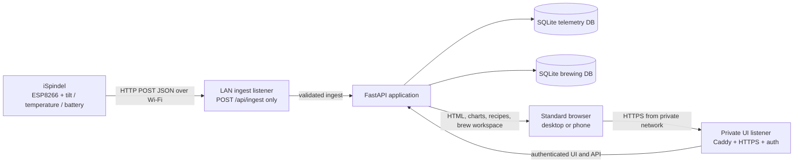
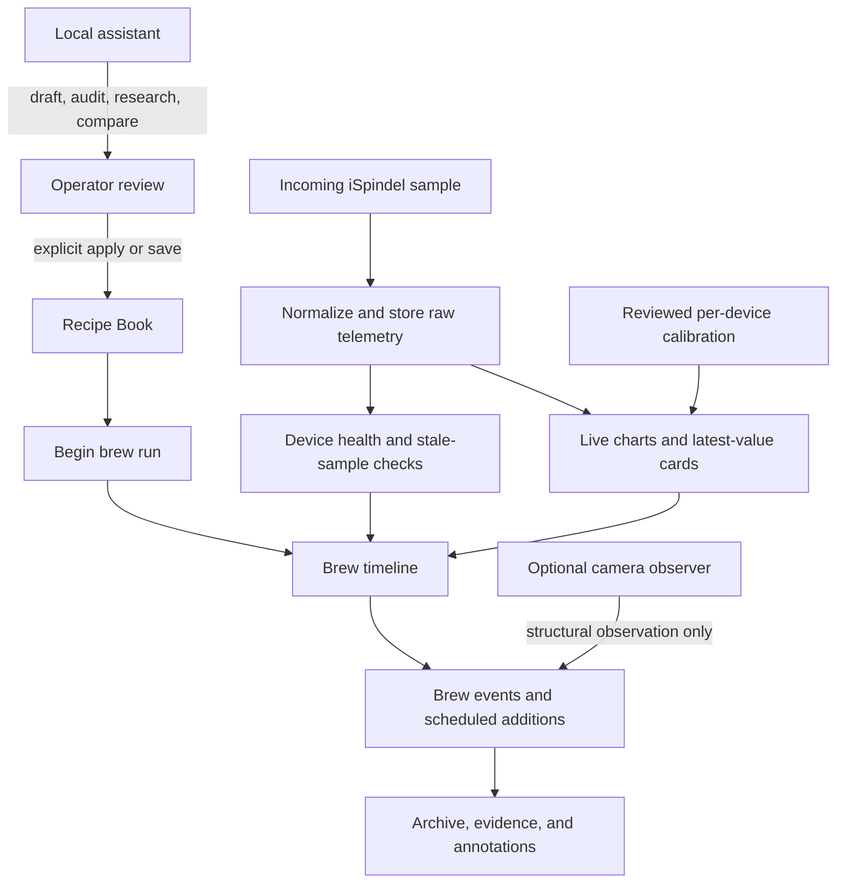

# Brewing Central — iSpindel Dashboard

[](https://github.com/carlkrott/ispindel-dashboard-public/actions/workflows/ci.yml)
[](https://github.com/carlkrott/ispindel-dashboard-public/actions/workflows/security.yml)
[](https://github.com/carlkrott/ispindel-dashboard-public/actions/workflows/container.yml)
[](https://github.com/carlkrott/ispindel-dashboard-public/actions/workflows/codeql.yml)

Brewing Central is a self-hosted, browser-first workspace for **iSpindel
fermentation telemetry**, recipes, brew records, and local operator guidance.
It is built for people who want their brewing data on a private network rather
than in a hosted dashboard.

The upstream hardware and firmware project is
[universam1/iSpindel](https://github.com/universam1/ispindel). This repository
provides the receiving service and brewing workspace around stock iSpindel
devices; it does not replace the upstream firmware or hardware.

## What is an iSpindel?

An [iSpindel](https://github.com/universam1/ispindel) is a DIY floating
electronic hydrometer for home brewing. In simple terms:

1. The device floats in the fermenter.
2. An accelerometer observes the device's tilt. The tilt changes as the
   liquid's density changes.
3. The device also measures temperature, battery state, and Wi-Fi signal
   strength.
4. Stock firmware sends those readings as JSON over Wi-Fi at a configured
   interval.
5. A calibration curve turns the device-specific tilt response into a useful
   gravity estimate such as specific gravity (SG) or Plato.

Every physical build behaves a little differently, so calibration is part of
the normal setup. Brewing Central keeps the raw telemetry available while
allowing a reviewed calibration to provide a calibrated gravity view.

## What this project provides

| Area | Capability |
| --- | --- |
| Live telemetry | Responsive dashboard with device overview, last-seen state, stale-device visibility, and live-refreshing charts. |
| Sensor views | Gravity, temperature, battery, tilt angle, and Wi-Fi RSSI with selectable time windows from minutes to one week. |
| Calibration | Per-device calibration history, polynomial fits, raw-versus-calibrated gravity, and a water-reference check before activation. |
| Recipe Book | Recipes for beer, wine, mead, cider, kombucha, or other beverages with ingredients, cultures, additions, process steps, targets, and notes. |
| Recipe scaling | Fixed, linear, power, and piecewise scaling rules with a live target-volume preview. |
| Brew Control & Archive | Start and stop brew runs, attach an iSpindel and recipe, record events, track scheduled additions, freeze archive evidence, and annotate outcomes. |
| Local assistant | Queued recipe and brew jobs for chat, autofill, audits, rewrites, brew analysis, event drafts, and archive comparison. Results are proposals until an operator reviews and applies them. |
| Research context | Optional bounded research through configured SearXNG, Kiwix, or other approved agent tools, with source links and evidence status retained. |
| Structural camera checks | Optional camera observations for gross physical conditions such as a shifted vessel, spill, overflow, blocked view, or poor lighting. Camera evidence never substitutes for telemetry or claims fermentation activity. |
| Operations | Health endpoints, rate limiting, request-size limits, backup verification, restore rehearsal, staged deployment helpers, and a disposable container runtime contract. |

## System flow

### Telemetry and browser flow

The hardened private topology keeps stock iSpindel compatibility on the LAN
while putting the browser experience behind an authenticated private-network
listener. Local development can run FastAPI directly on loopback instead.



### From sample to brew archive



## Try it locally

The development mode is intended for a loopback-only workstation. It uses
SQLite files under the local `data/` directory and deliberately does not
require production token or private-network configuration.

```bash
git clone https://github.com/carlkrott/ispindel-dashboard-public.git
cd ispindel-dashboard-public

python3.12 -m venv .venv
source .venv/bin/activate
python -m pip install -r requirements.txt

ISPINDEL_MODE=development \
  python -m uvicorn app.main:app --host 127.0.0.1 --port 8098
```

Open <http://127.0.0.1:8098/> in a standard browser. FastAPI's interactive
API documentation is available at <http://127.0.0.1:8098/docs>.

To create a synthetic sample, use the same JSON shape accepted by stock
firmware:

```bash
curl -fsS -X POST http://127.0.0.1:8098/api/ingest \
  -H 'Content-Type: application/json' \
  -d '{
    "ID": "demo-ispindel",
    "angle": 30.2,
    "gravity": 1.042,
    "temperature": 20.1,
    "battery": 4.1,
    "RSSI": -70,
    "SSID": "demo-network",
    "sleep": 300
  }'
```

Refresh the dashboard and select `demo-ispindel`. The sample will appear in
the device list and telemetry chart.

> Development mode disables production ingest authentication. Keep the
> development server bound to loopback; do not expose it to a LAN or the
> internet.

## Point a stock iSpindel at the service

Stock firmware can send its normal JSON payload directly to the ingest route:

| Setting | Value |
| --- | --- |
| Server URL | `http://<LAN_INGEST_HOST>:8098/api/ingest` |
| Method | `POST` |
| Content type | `application/json` |
| Device identity | `ID` (the service also accepts compatible identity aliases) |
| Telemetry | `angle`, `gravity`, `temperature`, `battery`, `RSSI`, and other stock fields |
| Production credential | JSON body field `token`, because stock firmware does not provide header/query-token authentication |

The first useful production check is not merely an HTTP 200 response: confirm
that a new sample is stored for the expected device across more than one sleep
interval. The deeper operational checks are documented in
[docs/OPERATIONS.md](docs/OPERATIONS.md) and
[docs/PHONE-RUNBOOK.md](docs/PHONE-RUNBOOK.md).

## Deployment shapes

| Shape | Use | Important boundary |
| --- | --- | --- |
| Python + Uvicorn | Local development and quick evaluation | Bind to loopback and use `ISPINDEL_MODE=development`. |
| Docker Compose | Reproducible application runtime | The qualified image target is `linux/amd64`; the container runs as a non-root user with a read-only filesystem. |
| Caddy + private network | Hardened browser and LAN-ingest edge | The LAN surface is restricted to `POST /api/ingest`; the browser surface uses private HTTPS and authentication. |
| Android / Termux companion | Native phone-hosted application and camera workflows | This is a separate native runtime, not an ARM Docker target. |

The assistant and research integrations are optional. When enabled, the
application treats model output as bounded, reviewable proposals rather than
unreviewed writes. ZeroClaw is a transport/orchestration integration; it is
not required for telemetry ingestion or the core dashboard.

## Repository tools

### Development and verification

```bash
make test-unit       # source/unit suite
make test-browser    # Playwright browser suite
make test-runtime    # disposable Docker runtime contract
make test            # unit suite followed by runtime contract
```

The project also includes:

- [Health and polling tools](scripts/ispindel-check.py) for one-shot service
  checks and stable machine-readable output.
- [Backup and restore tooling](scripts/backup-production.py), including
  checksum verification and a disposable restore rehearsal.
- [Network-boundary verification](scripts/verify-network-boundary.sh) for the
  Caddy ingest/UI split.
- [Staged deployment helpers](scripts/deploy/) covering predecessor backup,
  rehearsal, promotion, live validation, and rollback.
- [Container and release validation](scripts/build-release.sh) for
  source-identical images, dependency locks, and release evidence.
- A static browser UI with Chart.js, responsive layouts, accessible data
  tables, keyboard-friendly controls, and an installable browser shell.

## Security and data boundaries

- Production ingest uses per-device token verification, constant-time
  comparison, a per-device rate limiter, and a bounded request body.
- The container is designed to run without root privileges, with a read-only
  root filesystem, dropped Linux capabilities, and read-only secret/evidence
  mounts.
- Telemetry and brewing records are stored locally in separate SQLite
  databases; no hosted database is required.
- Real tokens, private keys, certificates, databases, backups, and host-specific
  configuration belong outside the repository. Use the tracked example files
  as templates only.
- This project is designed for a private/local network, not direct exposure
  to the public internet.

Read [SECURITY.md](SECURITY.md) before configuring credentials or changing an
exposure boundary.

## Documentation map

- [Architecture](docs/ARCHITECTURE.md) — runtime components and data flows
- [Operations](docs/OPERATIONS.md) — service ownership, health, alerts, and
  evidence
- [Security](docs/SECURITY.md) — authentication and network boundaries
- [Recovery](docs/RECOVERY.md) — backup, restore rehearsal, and rollback
- [Phone runbook](docs/PHONE-RUNBOOK.md) — native Android/Termux lifecycle and
  recovery
- [Hardening backlog](docs/HARDENING-BACKLOG.md) — deferred operational work

## Credits

The iSpindel device and firmware are maintained in the upstream
[universam1/iSpindel repository](https://github.com/universam1/ispindel).
Brewing Central is the self-hosted dashboard and brewing-workspace layer built
around that project.

See [LICENSE](LICENSE) for the repository license.